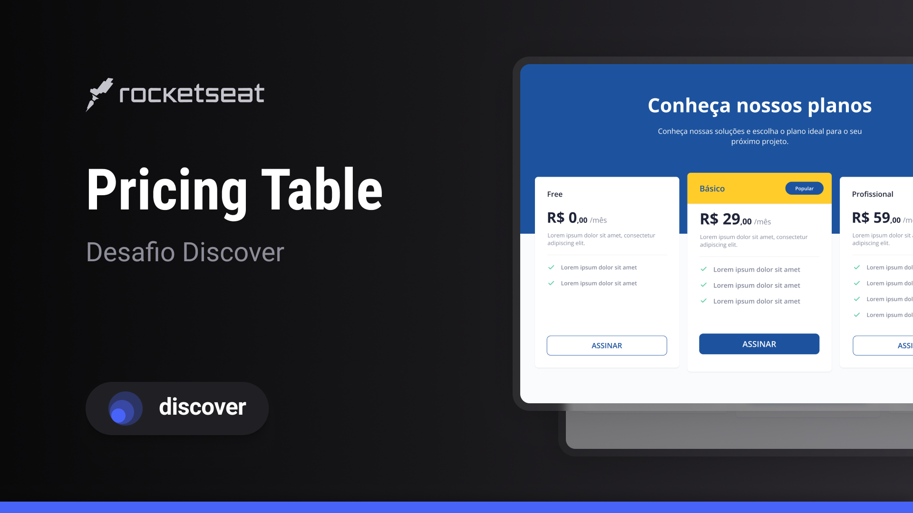

  

<!--  -->

<h2 align="center">Tecnologias 🚀</h2>
   

Esse projeto foi desenvolvido com as seguintes tecnologias:

- **HTML** **e** **CSS**

  
  ---
  <h3 align="center">Projeto💻 </h3>
  
Acesse o projeto em <a href="https://micaela-marques.github.io/princingtables/"> site🌐
  

---

<h2 align="center">Layout 🎨</h2>

Acesse o layout do projeto <a href="https://www.figma.com/file/yx7mLsKdqJTYEMAL1KUwWG/Pricing-Table-%E2%80%A2-Desafio-Discover-(Community)?node-id=0%3A1&mode=dev" 

